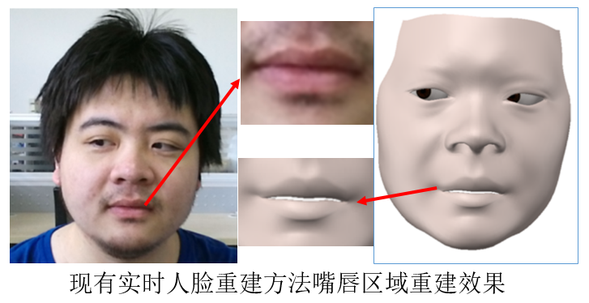
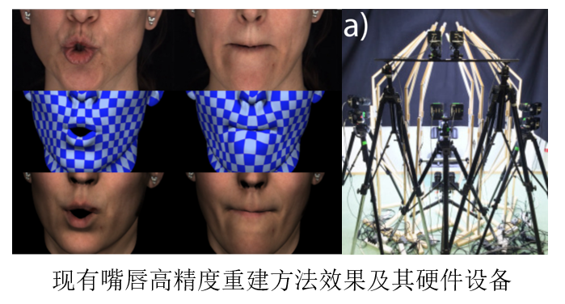

前言
------
我的硕士课题是人脸局部区域三维重建；分为两部分内容：
>1. RGB相机实时高精度人嘴唇三维重建
>2. RGB图像眼镜三维重建  

下文简单介绍工作内容，展示工作结果

简介
-------
####RGB相机实时高精度人嘴唇三维重建  
**背景**：实时人脸重建系统局部精度低；高精度人脸局部区域重建算法复杂，硬件要求高；嘴唇是人脸上形变较大的区域，三维重建嘴唇有挑战性。  

 

  
**相关工作**： 
1. 3d人脸形变模型[]：一组已有的三维人脸，通过线性组合可以生成新的人脸 
2. 二维人脸图像重建三维人脸常见方法： 二维图像检测人脸特征点，用特征点提供人脸形状信息;最优化方法求解3d人脸形变模型线性组合的系数，使合成的三维人脸尽可能逼近二维特征点。

**出发点**： 
1. 特征点数量有限，包含的人脸形状信息也有限。不同人嘴唇形状差异很大，人表情夸张时嘴唇能产生很大的形变，少量特征点无法表征复杂的形状。因此希望用特征线代替特征点，为三维重建提供足量的信息。 
2. 边缘检测是图像处理领域中一个研究成熟的分支，有很多强力的方法可以用。 

**目标**：嘴唇区域高精度重建；实时；硬件要求低(仅输入RGB图像) 
**方法**: 

 
**结果**： 
1. 精细唇线提取效果  
    
2. 嘴唇三维重建效果:右侧视频最左是原图，中间是快手网络重建效果，右侧是嘴唇高精度重建结果  

  
---------
####RGB图像眼镜三维重建
**背景**：眼镜可以认为是人脸的外沿部分，显著影响人脸外观；三维重建人脸同时重建出三维眼镜，能达到更具真实感的三维人脸重建效果 
**目标**：输入戴眼镜人脸图像，重建结果尽可能逼近图像；图像人脸姿态不限；图像来源不限   
**相关工作**： 
1. 眼镜相关的工作不多；主要有 1>从人脸图像中去除眼镜 2>检测人脸图像中是否有眼镜。有论文[]从图像序列中恢复人脸深度，并重建眼镜。没有只输入单张图像重建三维眼镜的工作。 
2. 拉普拉斯形变：拉普拉斯算子能提取三维网格的局部特征；保证网格的拉普拉斯坐标不变，网格顶点位置变化，能达到保留局部形状特征的变形效果。[]   
**出发点**：
与人脸相相似，眼镜是高度结构化的物体，在基本相同的结构下有各种形变；人脸三维重建中，用已有的三维人脸模型给重建提供了人脸结构的先验知识；扩展至眼镜，可以用已有的三维眼镜模板，变形成新的三维眼镜。   

**方法**：图像检测镜框；以二维像素驱动三维眼镜模板拉普拉斯形变 
**结果**:  

  

算法
------

references
----------
[]Blanz V. A morphable model for the synthesis of 3D faces[J]. Acm Siggraph, 2002:187-194.  
[]Maninchedda F , Oswald M R , Pollefeys M . Fast 3D Reconstruction of Faces with Glasses[C]// 2017 IEEE Conference on Computer Vision and Pattern Recognition (CVPR). IEEE, 2017.  
[]Sorkine O . Differential Representations for Mesh Processing[J]. Computer Graphics Forum, 2006, 25(4):789-807.  
