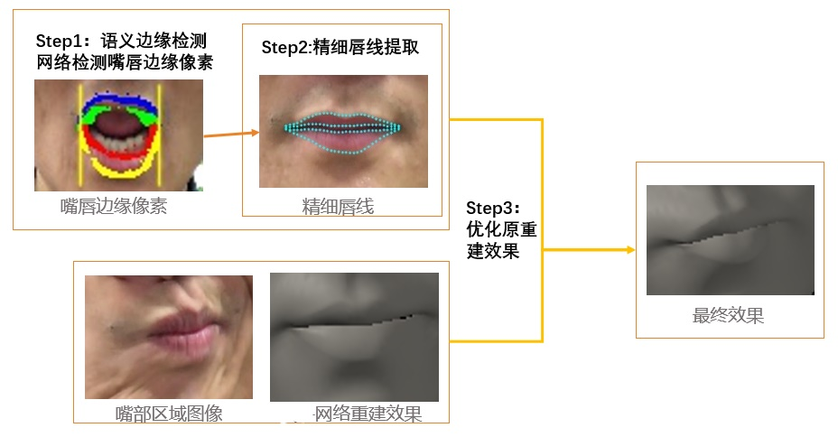
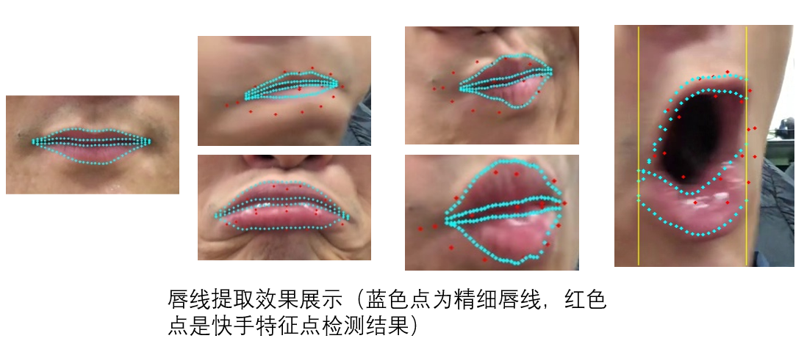
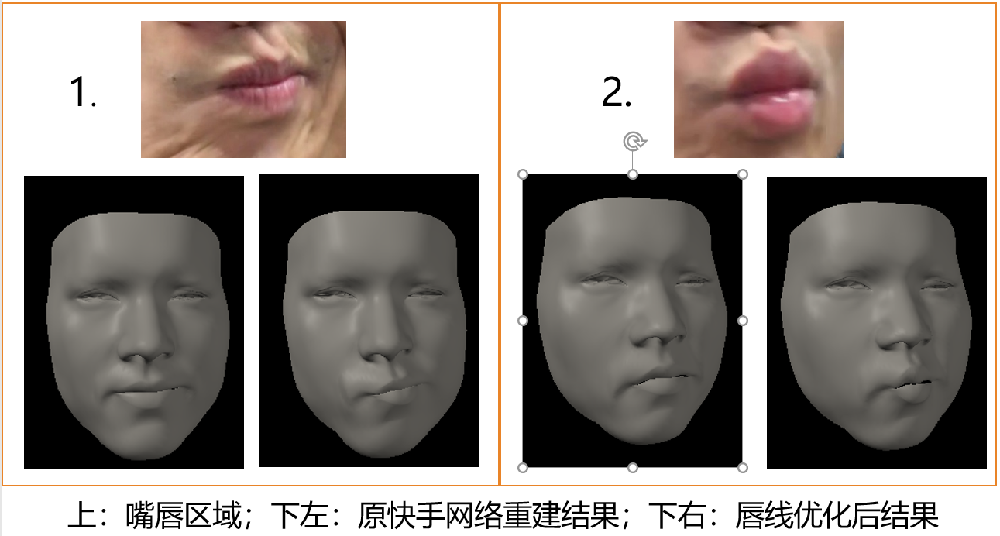
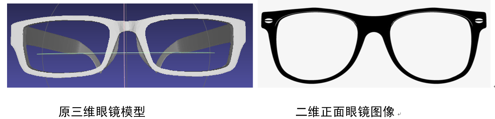
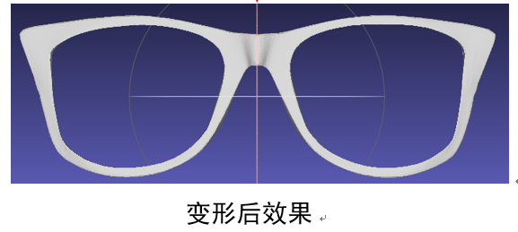
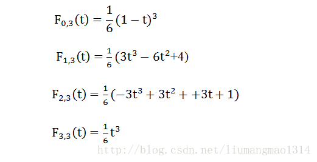

前言
------
我的硕士课题是人脸局部区域三维重建；分为两部分内容：
>1. RGB相机实时高精度人嘴唇三维重建
>2. RGB图像眼镜三维重建  

下文简单介绍工作内容，展示工作结果

简介
-------
RGB相机实时高精度人嘴唇三维重建（企业合作项目）
-------
**背景**：实时人脸重建系统局部精度低；高精度人脸局部区域重建算法复杂，硬件要求高；嘴唇是人脸上形变较大的区域，三维重建嘴唇有挑战性。  

 

  

**相关工作**： 
>1. 3d人脸形变模型[1]：一组已有的三维人脸，通过线性组合可以生成新的人脸 
>2. 二维人脸图像重建三维人脸常见方法： 二维图像检测人脸特征点，用特征点提供人脸形状信息;最优化方法求解3d人脸形变模型线性组合的系数，使合成的三维人脸尽可能逼近二维特征点。

**出发点**： 
>1. 特征点数量有限，包含的人脸形状信息也有限。不同人嘴唇形状差异大，人表情夸张时嘴唇能产生很大的形变，少量特征点无法表征复杂形状信息。因此希望用特征线代替特征点，为三维重建提供足量的信息。 
>2. 边缘检测是图像处理领域中一个研究成熟的分支，有很多强力的方法可以用。 

**目标**：嘴唇区域高精度重建；实时；硬件要求低(仅输入RGB图像) 
**方法**: pipeline如下图所示 
>1. 语义边缘检测神经网络检测嘴唇边缘像素，使用ICCV15-holistically-nested edge detection论文中提到的网络结构[2]。网络训练所用的数据集是自己标注并数据增强的。 该网络可以实现 用嘴唇边缘训练网络，网络就只检测嘴唇边缘。
>2. B样条曲线拟合提取精细唇线。精细唇线不仅可以用于嘴唇三维重建，还可以用在自动上唇妆等应用中。
>3. 已有3d人脸形变模型、人脸特征点检测和基于神经网络的人脸重建方法；用2中精细唇线改善原重建效果，得嘴唇高精度重建结果。即在精细唇线上找三维嘴唇顶点的对应点，优化求解人脸形变模型的线性组合系数。  

    

**关键算法**：  
>1. 训练和使用基于caffe(C++)的边缘检测神经网络
>2. 测试了曲线拟合的多种方法；实现B样条曲线拟合
>3. 实现基于正交投影模型的二维图像三维人脸重建方法，迭代求解人脸姿态、形状和表情
>4. 高斯牛顿法/LM优化法求解非线性最优化问题；最小二乘法求解线性最优化问题
>5. opengl渲染人脸重建结果

**结果**： 
1. 精细唇线提取效果  
    
 
2. 嘴唇三维重建效果:右侧视频最左是原图，中间是神经网络重建效果，右侧是嘴唇高精度重建结果  

  
   

**成果**： 
导师指导下独立完成，已完成与公司的交接；申请两篇专利 
  
  
RGB图像眼镜三维重建
------  

**背景**：眼镜可以认为是人脸的外沿部分，显著影响人脸外观；三维重建人脸同时重建出三维眼镜，能达到更具真实感的三维人脸重建效果 
**目标**：输入戴眼镜人脸图像，重建结果尽可能逼近图像；图像人脸姿态不限；图像来源不限   
**相关工作**： 
>1. 眼镜相关的工作不多；主要有 1>从人脸图像中去除眼镜 2>检测人脸图像中是否有眼镜。有论文[3]从图像序列中恢复人脸深度，并重建眼镜。没有只输入单张图像重建三维眼镜的工作。
>2. 拉普拉斯形变[4]：拉普拉斯算子能提取三维网格的局部特征；保证网格的拉普拉斯坐标不变，网格顶点位置变化，能达到保留局部形状特征的变形效果。 
>3. 基于点对点对应关系的姿态求解：已知相机的内参、二维点和三维点间的对应关系，求解三维模型相对于相机的位姿。目前最有效的方法是EPNP[5],在opencv中有实现。  

**出发点**：
>与人脸相相似，眼镜是高度结构化的物体，在基本相同的结构下有各种形变；人脸三维重建中，用已有的三维人脸模型给重建提供了人脸结构的先验知识；扩展至眼镜，可以用已有的三维眼镜模板，变形成新的三维眼镜。   

**方法**：图像检测镜框；以人脸姿态为先验求解眼镜姿态，对齐镜框至正面；以二维像素驱动三维眼镜模板拉普拉斯形变，使变形后的三维眼镜尽可能与二维图像相同 
程序运行顺序如下：  
>1. 检测人脸特征点，截取镜框区域，用特征点计算人脸姿态  
>2. 语义边缘检测神经网络检测镜框边缘像素
>3. 按照人脸姿态投影三维模板眼镜；在边缘像素中给投影点找对应点，使对应点云的形状与投影点云尽量相似
>4. 以人脸姿态为优化初始值，以2中对应关系，解优化问题求眼镜姿态；再用眼镜姿态重新投影并计算对应点，迭代上述步骤。最终得眼镜的姿态和三维眼镜投影点的对应点。
>5. 以眼镜姿态正面化对应点，以对应点云的形状驱动三维眼镜模板拉普拉斯变形  

由于不清楚眼镜拉普拉斯变形需要什么信息，因此先探索实现了眼镜的变形，再实现从图像中提取。即先实现了5再实现1-4。目前实现了5,1,234是部分实现。

**关键算法**：  
>1. 拉普拉斯三维网格变形算法
>2. 实现基于透视投影模型和点到点对应关系，同时估计物体姿态和相机内参的算法;由EPNP算法求解到眼镜姿态的初值，随后用高斯牛顿法优化初值，得更精准的姿态。
>3. 实现ICP、alpha shape等算法

**结果**:  
1. 二维像素驱动的拉普拉斯变形结果  

  

references
----------
[1]Blanz V. A morphable model for the synthesis of 3D faces[J]. Acm Siggraph, 2002:187-194. 
[2]Xie S, Tu Z. Holistically-Nested Edge Detection[J]. International Journal of Computer Vision, 2015, 125(1-3):3-18.   
[3]Maninchedda F , Oswald M R , Pollefeys M . Fast 3D Reconstruction of Faces with Glasses[C]// 2017 IEEE Conference on Computer Vision and Pattern Recognition (CVPR). IEEE, 2017.  
[4]Sorkine O . Differential Representations for Mesh Processing[J]. Computer Graphics Forum, 2006, 25(4):789-807.  
[5]Lepetit V , Moreno-Noguer F , Fua P . EPnP: An AccurateO(n) Solution to the PnP Problem[J]. International Journal of Computer Vision, 2009, 81(2):155-166.

supplementary
-------------
  

